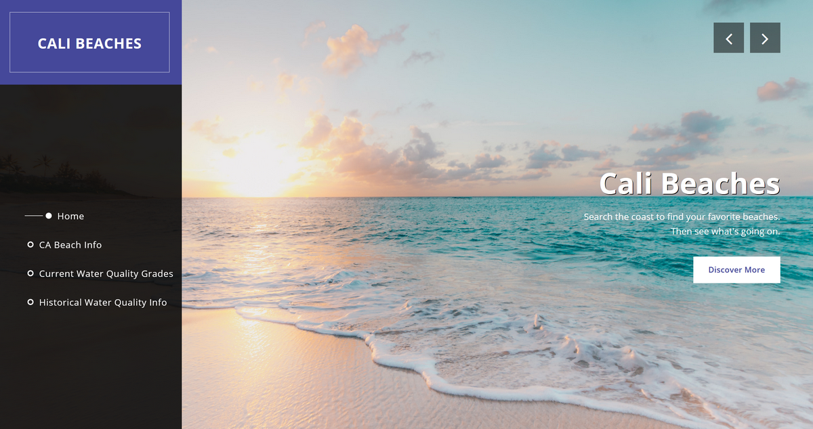
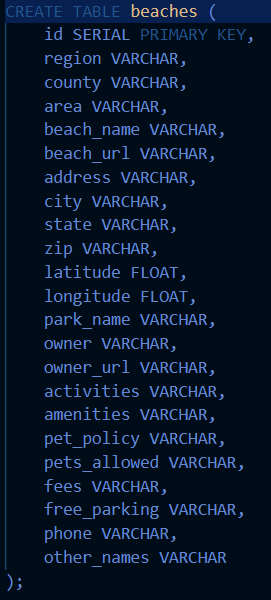
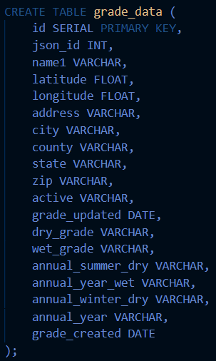
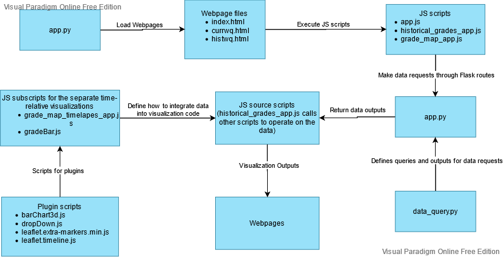
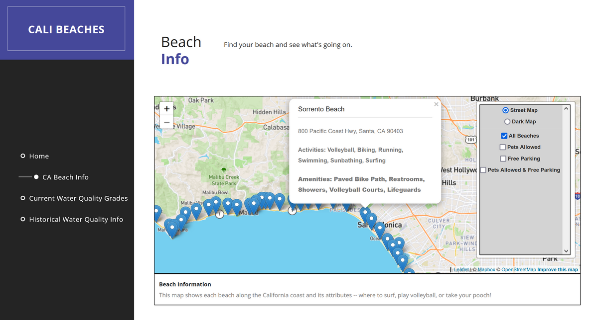
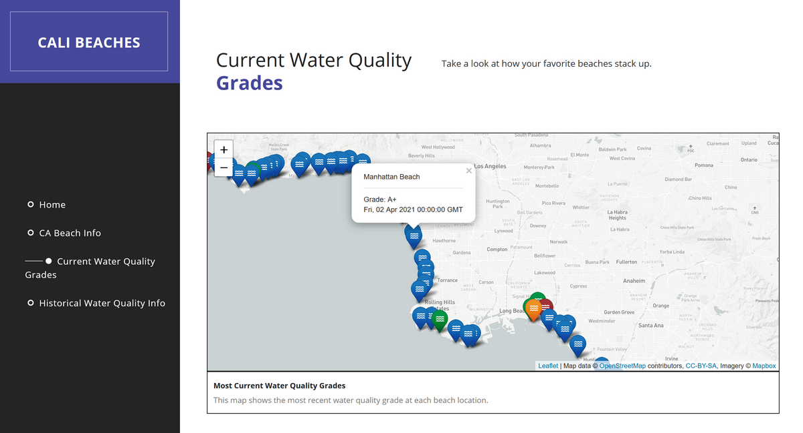
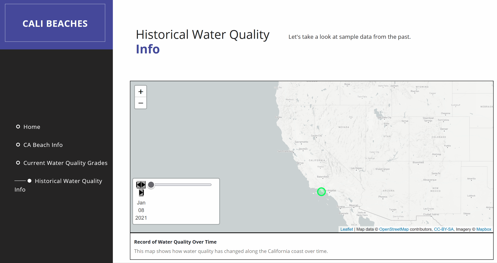
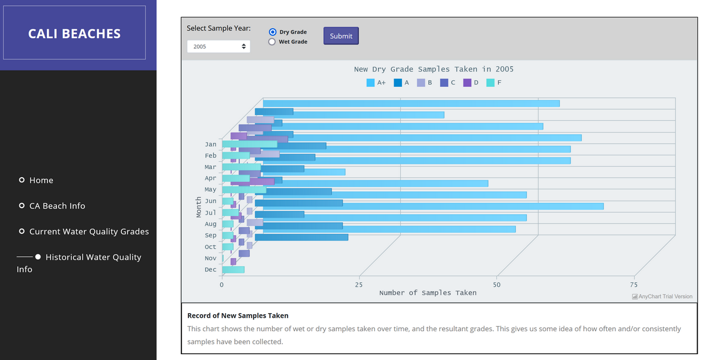

# California Beach Water Quality Report

## Summary
A web application that includes a database repository and dashboard that uses geomapped visualizations to illustrate water quality of beaches along the California coastline. This repository also includes script that performs webscraping to retrieve the data.

A final report is provided above, titled "Coastline CRUD.docx"

Live Web App: https://project-two-jh-ks-sw.herokuapp.com/

## App/Files Workflow
### Data Retrieval and Description
The app showcases two sets of data in general:
1. General information about the beach and its amenities (e.g. address, parking, pet policy) 
Source: https://www.californiabeaches.com/beaches/

2. Water quality data 
Historical data source: https://beachreportcard.org/ 
Current data source: https://admin.beachreportcard.org/api/locations

### Web App
#### Webscraping
All webscraping is performed through Python and BeautifulSoup. General beach information is scraped through scrape_CAbeaches.py and historical water quality data is retrieved through get_histData.py. The most recent water quality data is retrieved from a JSON document online through get_qualityData.py. All data is moved to a postgreSQL database using SQLAlchemy, hosted within Heroku.

#### SQL Database
The SQL database consists of two separate tables. "beaches" contains the general beach information, while "grade_data" contains the water quality data. 
 

#### App Infrastructure
The app uses Flask to execute the movement of data from the SQL server to the dashboard. The page HTML executes JavaScript that call respective API routes within app.py, each executing a function to retrieve data from the server (e.g. beach_query(), grades_query()). All query functions are defined within 
data_query.py, all of them constructing Python objects to return back to the Flask app, which in turn converts the data to JSON objects for the JavaScript to retrieve and render through the visualizations.

#### Dashboard
The information is displayed across multiple maps and visualizations on the app.

##### CA Beach Info
General information on the beaches is displayed as a map markers.

##### Current Water Quality Grades
Current water quality grades on the beaches are displayed as colored map markers.

##### Historical Water Quality Info
A timelapse map visualization shows markers as water quality recordings, using the Leaflet-timeline plugin for Leaflet.js. The colors represent the water quality (green=good, red=poor).

A bar chart visualization using the AnyChart plugin shows the number of records were taken for each possible grade within a specific year. Users can apply a year to observe through the dropdown and which grade to review; the dry grade (non-rainy waither conditions) or wet grade (rainy weather conditions). 

## Credits
* (2021). CaliforniaBeaches.com. https://www.californiabeaches.com/beaches/
* (2018). Beach Report Card. https://beachreportcard.org/
* (2021). templatemo. https://templatemo.com/tm-518-sentra

